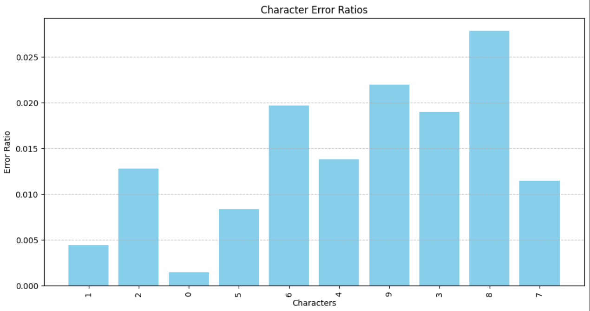

# Fa1eme Project1


Handwritten Digit Recognition Using CRNN


This project implements a deep learning model for recognizing handwritten digits from images.
The model uses a hybrid architecture combining a convolutional neural network (CNN) and a recurrent neural network (RNN), commonly referred to as a CRNN.
This combination enables the model to extract visual features and analyze sequential information, resulting in higher accuracy in recognition.

The project can be extended to build OCR systems, digit recognition in digital forms, or lightweight models trained on custom datasets.


## Features

- Recognizes handwritten digits from images with high accuracy

- Uses a hybrid CNN and RNN architecture (CRNN)

- Can be trained on custom datasets (e.g., MNIST or user-provided data)

- GPU support for faster training

- Clean and modular codebase for easy customization and extension

- Automatically handles image input and preprocessing

- Supports saving and loading trained models

- Suitable for OCR projects and form reading applications


## Installation

Install my-project with npm

```bash
tensorflow==2.18.0
numpy==2.0.2
matplotlib==3.10.0
opencv-python==4.12.0
editdistance

```
    
## Usage


After installing the required packages and preparing the dataset, simply run the `main.py` file to start the project:



